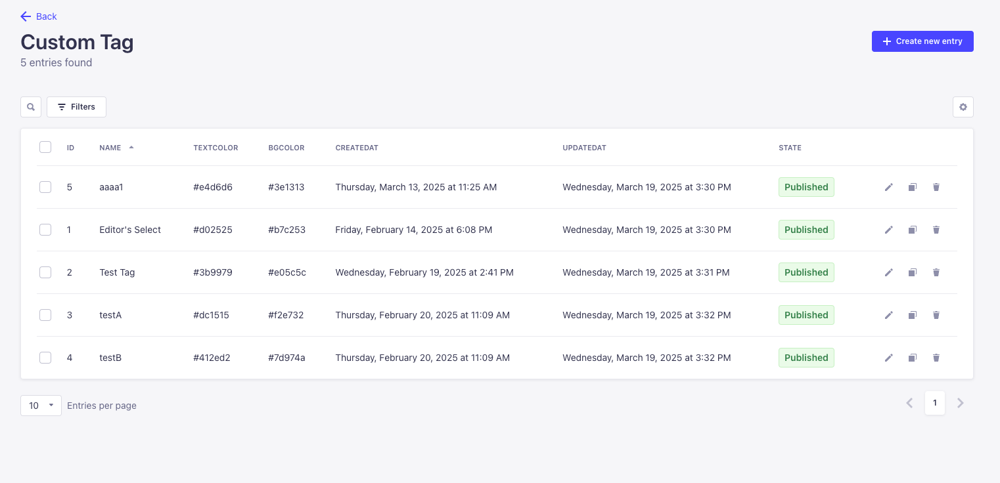
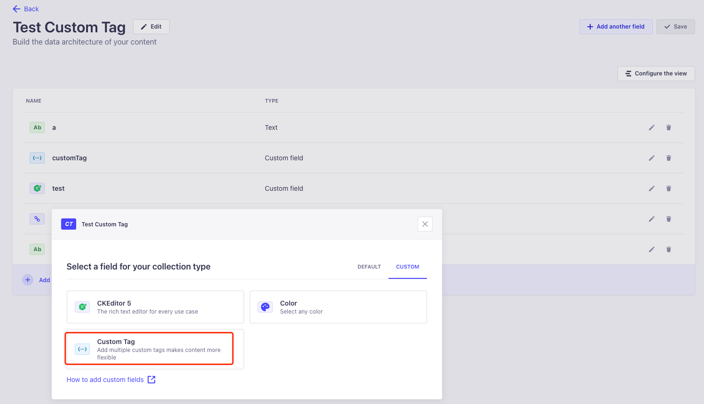

    

<h1 align="center">
  Strapi Plugin Custom Tag
</h1>

A Strapi plugin that enables a flexible and efficient tagging system for your content. With this plugin, you can organize, categorize, and filter your content dynamically using tags.

🚀 Features

- Easy Tag Management: Create, update, and delete tags effortlessly.

- Content Association: Attach multiple tags to any content type.

- API Integration: Provides endpoints for managing tags via REST API.

- Admin Panel UI: Manage tags conveniently from the Strapi admin panel.

- Search & Filtering: Retrieve content based on associated tags.

- Supports label color customization.

# Installation
Since this plugin supports customization of label colors, you must first install the following plugin before installing.

`npm install @strapi/plugin-color-picker`

`yarn add @strapi/plugin-color-picker`

After installing the above dependency plugin, you can now install this plugin

`npm install strapi-plugin-custom-tag`

`yarn add strapi-plugin-custom-tag`

# Usages

After installing and restarting the system, you will see a Collection Type of Custom Tag in Content Manager, which is where we can customize the tags.

## Create Tag Page

## Integration

To use the tag we created, we can add a field in the Content Type Builder and select Custom Tag under Custom, so that we can associate the tag with our content, and it supports multiple selection.

## Restful API

You can query the list of tags and fuzzy matching tag names, and when you don't add a name query, you can query all published tags.

`GET    /custom-tag/list?name=keyword`

You can also query the specified tag information by id.

`GET    /custom-tag/info?id=1`
## 👍 Contribute

If you want to say **Thank You** and/or support the active development of `Strapi Plugin Operation Logs`, you can support us by:

1. Add a [GitHub Star](https://github.com/SherlockTong/strapi-plugin-custom-tag/stargazers) to the project.
2. Support the project by donating a [cup of coffee](https://ko-fi.com/sherlocktong).